# (C# 코딩) 사칙연산 계산기

## 개요

  - **C# 프로그래밍 학습** 
  - **1줄 소개**: 
    사칙연산(`+`, `-`, `*`, `/`) 기능을 구현하여 기초적인 수식 계산을 수행하는 Windows Forms 프로그램
  - 사용한 플랫폼: 
    C#, .NET Windows Forms, Visual Studio, GitHub
  - 사용한 컨트롤: 
    `Button`(숫자 및 연산자 입력), `TextBox`(`txtUserInput` - 입력 과정 표시, `txtResult` - 결과값 표시)
  - 사용한 기술과 구현한 기능:
    - 연산에 사용될 두 정수 저장 변수(`firstNumber`, `secondNumber`) 설정
    - 선택된 연산자(`+`, `-`, `*`, `/`)를 저장하는 변수 설정
    - 계산 완료 후 새로운 입력을 받을 때 화면을 초기화하기 위한 상태 제어 변수 `bool calculationCompleted` 설정
    - 여러 버튼을 하나의 메서드(`NumberButton_Click`)에 연결하여 코드 효율성 극대화

## 실행 화면 (과제 1)
-과제1 코드의 실행 스크린샷

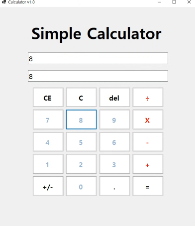

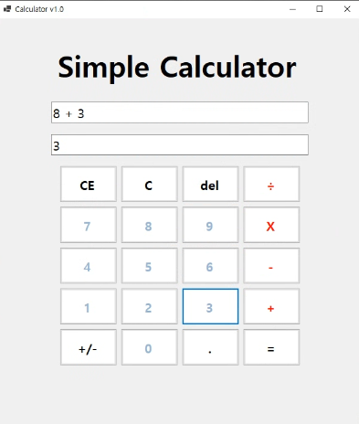

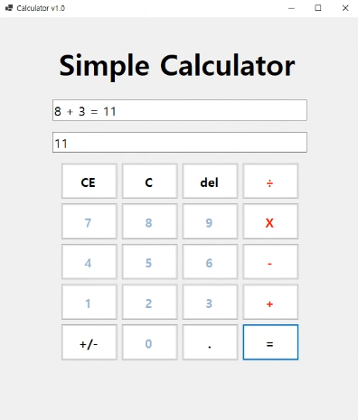

  - 과제 내용
      - `Form` 디자인을 통해 숫자(0-9), 더하기(+), 결과(=) 버튼 및 결과를 표시할 `TextBox`를 적절히 배치합니다. 
      - 클릭 이벤트를 통해 사용자가 입력한 문자열 숫자를 정수형(`int`) 데이터로 변환하고, 덧셈 연산이 수행된 후 다시 문자열로 출력하는 기본 로직을 구현합니다.

  - 구현 내용과 기능 설명
      - **숫자 입력 로직**: `NumberButton_Click` 메서드 내에서 `sender` 객체를 활용해 클릭된 버튼의 `Text`를 `txtUserInput`에 누적합니다. 만약 `calculationCompleted`가 `true`라면 기존 내용을 비우고 새로 입력을 시작합니다.
      - **덧셈 연산 처리**: `btnCalculatorPlus_Click` 메서드에서 `int.TryParse`를 사용하여 현재 입력된 값을 `firstNumber`에 저장하고, `operation` 변수에 `'+'`를 할당합니다.
      - **결과값 실시간 반영**: 연산자가 입력되기 전까지는 `txtResult`에 현재 입력 중인 숫자를 실시간으로 보여주어 사용자 편의성을 높였습니다.

## 실행 화면 (과제2)
-과제2 코드의 실행 스크린샷

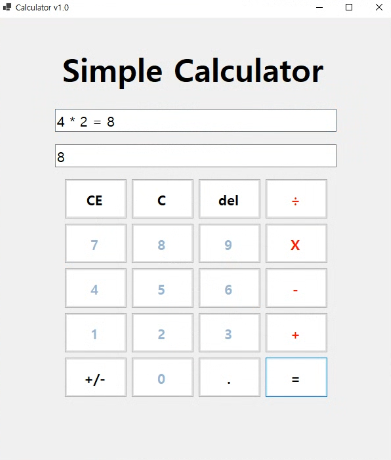

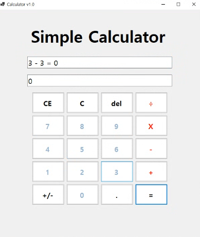

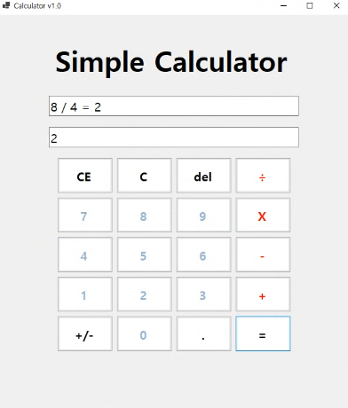

  - 과제 내용
      - 기존 덧셈 기능에 뺄셈(`-`), 곱셈(`*`), 나눗셈(`/`) 버튼을 추가하고 각각의 클릭 이벤트 메서드를 구현합니다.
      - 연산 기호를 기준으로 문자열을 분리하는 로직을 고도화하고, 수학적으로 불가능한 상황(0으로 나누기 등)에 대한 방어 로직을 추가하여 프로그램의 안정성을 확보했습니다.

  - 구현 내용과 기능 설명
      - **연산자 분리 및 추출**: `btnCalculatorEqual_Click` 메서드에서 `IndexOf(operation)`를 사용하여 수식 문자열 내 연산자의 위치를 찾습니다. 이후 `Substring` 메서드를 통해 연산자 왼쪽(`left`)과 오른쪽(`right`)의 피연산자를 분리하여 각각 `firstNumber`와 `secondNumber`에 할당합니다.
      - **다중 연산 로직**: `if-else` 조건문을 통해 `operation` 변수에 담긴 기호에 따라 각기 다른 산술 연산을 수행합니다. 계산이 완료되면 `txtUserInput`에 `5 + 3 = 8`과 같은 전체 수식을 표시합니다.
      - **예외 상황 대응**: 나눗셈 연산 시 `secondNumber`가 `0`인 경우 `MessageBox.Show`를 통해 경고 메시지를 출력하여 런타임 오류를 방지합니다. 또한, 연산 도중 앞뒤에 생길 수 있는 불필요한 공백은 `Trim()` 메서드로 제거하여 데이터의 무결성을 유지했습니다.

제공해주신 코드와 과제 목표를 바탕으로, 과제 3의 \*\*'수정 및 삭제 기능'\*\*에 특화된 README 내용을 작성해 드립니다. 기존 양식과 일관성을 유지하면서 구현된 메서드와 로직을 상세히 설명했습니다.

## 실행 화면 (과제3)
-과제3 코드의 실행 스크린샷

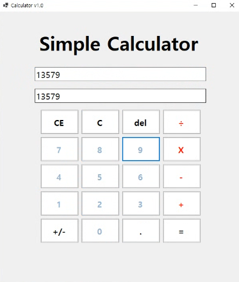

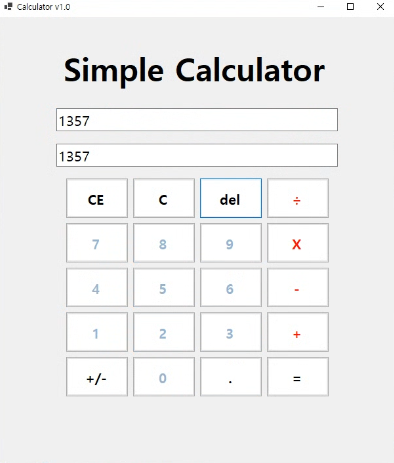

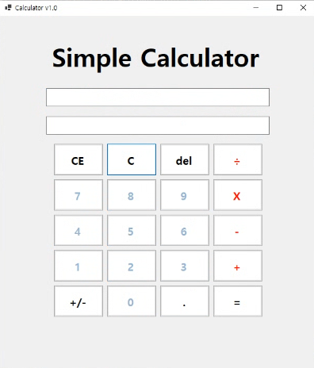

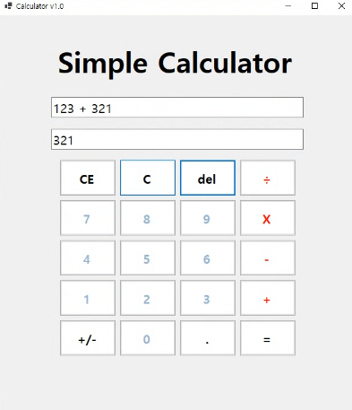

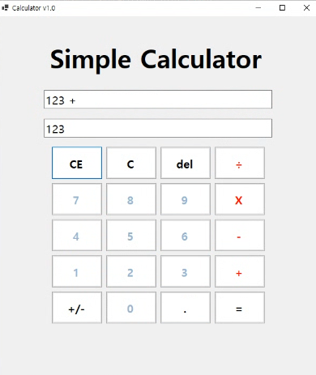

  - 과제 내용

      - 계산기 사용 중 입력 오류를 수정하기 위한 **C(Clear)**, **CE(Clear Entry)**, **Del(Delete)** 기능을 구현합니다.
      - **C 버튼**: 모든 계산 기록과 메모리 변수를 초기 상태로 되돌립니다.
      - **CE 버튼**: 현재 입력 중인 마지막 피연산자(숫자 뭉치)를 통째로 삭제합니다.
      - **Del 버튼**: 가장 최근에 입력된 글자 하나(숫자 한 자리)를 삭제하여 세밀한 수정을 가능하게 했습니다.

  - 구현 내용과 기능 설명
      - 3-1 사진에서 del 클릭 시 3-2가 됨. C 클릭시 3-3 처럼 모두 지워짐. 3-4 화면에서 CE 클릭 시 3-5 화면 처럼 연산자 오른쪽의 숫자만 제거함.
      - **전체 초기화 (C)**: `btnCalculatorC_Click` 메서드를 통해 `firstNumber`, `secondNumber`, `operation` 등 모든 내부 변수를 0 또는 Null 상태로 초기화하고, `txtUserInput`과 `txtResult` 창을 비웁니다.
      - **피연산자 삭제 (CE)**: `btnCalculatorCE_Click` 메서드에서 현재 입력 중인 수식(`txtUserInput`)을 분석합니다. 연산자가 이미 입력된 상태라면 `Substring`을 이용해 연산자 오른쪽의 숫자만 제거하고, 단일 숫자 입력 중이라면 전체를 삭제하여 이전 단계로 빠르게 되돌립니다.
      - **한 글자 삭제 (Del)**: `btnCalculatorDel_Click` 메서드에서 `Math.Max`와 `Substring`을 조합하여 문자열의 마지막 인덱스를 제거합니다. 숫자가 하나씩 지워짐에 따라 `txtResult` 화면도 실시간으로 갱신되며, 모든 숫자가 지워지면 연산자 대기 상태로 자연스럽게 전환되도록 로직을 구성했습니다.
      - **상태 기반 로직**: 계산이 완료된 상태(`calculationCompleted == true`)에서 삭제 버튼을 누를 경우, 단순 삭제가 아닌 화면 전체 초기화 후 새 입력을 준비하도록 개선했습니다.

-----

## 배운 내용

  - **코드의 재사용성**: 다수의 숫자 버튼을 하나의 `NumberButton_Click` 메서드로 처리하며 이벤트 핸들러의 매개변수(`sender`) 활용법을 이해했습니다.
  - **데이터 타입의 변환**: UI에서 얻는 `string` 데이터와 연산에 필요한 `int` 데이터 사이의 형변환 과정에서 `int.TryParse`를 사용한 안전한 변환 방식을 익혔습니다.
  - **상태 제어 로직**: 계산 완료 여부를 판단하는 `bool` 플래그를 활용해, 계산기 앱 특유의 초기화 및 연속 입력 로직을 구현하는 경험을 쌓았습니다.
  - **문자열 파싱 기술**: `IndexOfAny`와 `Split` 등을 활용해 복잡한 수식 문자열 내에서 특정 연산자나 피연산자 위치를 정확히 찾아내고 수정하는 방법을 익혔습니다.
  - **예외 상황의 세분화**: 계산 도중 삭제(`Del`)를 누를 때와 계산 완료 후 삭제를 누를 때의 로직을 분리하여, 실제 상용 계산기와 유사한 동작 흐름을 구현하는 법을 배웠습니다.

